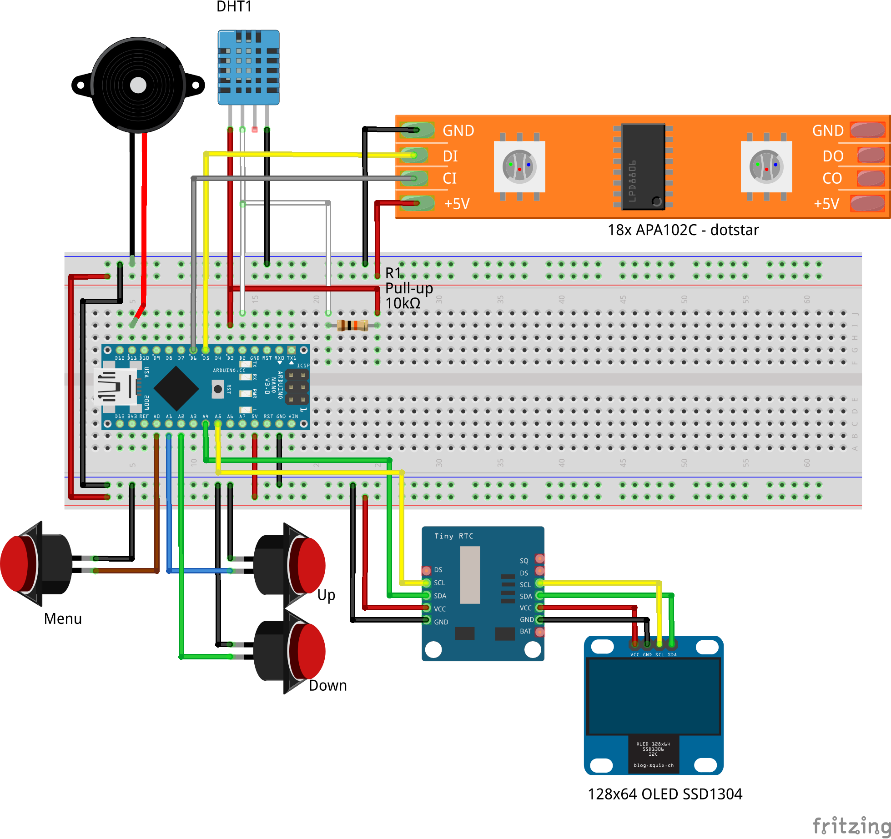

# Arduino_3dprinted_Lunar_Phase_Clock

<a rel="nofollow" href="https://www.youtube.com/watch?v=8Un9RubtGH0">https://www.youtube.com/watch?v=8Un9RubtGH0</a>

<h3>3D printed Lunar Phase Clock, designed by G4lile0 2016</h3>

<strong>Since there isn't a SuperMoon everyday, make one for your bedside table!!</strong>

If you don't know what to print with your 3D printer, here you have an easy project. 
Build a 3D printed Lunar Phase Clock for your desk.

Features: (check the video)

<ul>
<li>Open Tools (Ubuntu / FreeCAD / Arduino)</li>
<li>Open Source / Hardware</li>
<li>Cheap HW (Arduino, cheap LCD..) </li>
<li>Only 79 grams of filament.</li>
<li>Precise Lunar Phase Simulation</li>
<li>Detailed 3D printed Lunar model 
by Dexter_New_Materials (<a rel="nofollow" href="http://www.thingiverse.com/thing:1014620">http://www.thingiverse.com/thing:1014620</a>)</li>
<li>Alarm  </li>
<li>Wake-light alarm mode</li>
<li>Date </li>
<li>Thermometer</li>
<li>Hygrometer</li>
<li>Lamp mode</li>
<li>Moon FX modes (Relax, Party... )</li>
<li>Bright control</li>
<li>Adjustable tilt</li>
</ul>

Parts List:

<ul>
<li>Arduino compatible Nano (Atmel ATmega328)</li>
<li>0,96'' OLED 128x64 with SSD1306 chip</li>
<li>APA102C led strip  (18 leds)</li>
<li>Tiny RTC (DS1307 real time clock + 24C32 EEPROM)</li>
<li>DTH11 </li>
<li>Buzzer </li>
<li>3 Push Buttons</li>
</ul>

 

<h3>Reloj con fase Lunar impreso en 3D diseñado por G4lile0</h3>

<strong>Como no todos los días hay una SuperLuna ¡¡fabrícate una para la mesilla de noche!!</strong>

Si no sabes que imprimir con tu impresora en 3d, aquí tienes un reloj con fase lunar para tu mesa. 

<ul>
<li>Creado solo con herramientas libres (Ubuntu / Freecad / Arduino) </li>
<li>Open Source / Hardware</li>
<li>Electrónica económica (Arduino, LCD)</li>
<li>Tan solo 79 gramos de filamento</li>
<li>Precisa simulacion de la fase lunar</li>
<li>Modelo detallado de la luna 
by Dexter_New_Materials (<a rel="nofollow" href="http://www.thingiverse.com/thing:1014620">http://www.thingiverse.com/thing:1014620</a>)</li>
<li>Reloj analogico y digital</li>
<li>Alarma con simulación de amananecer</li>
<li>Alarma</li>
<li>Fecha</li>
<li>Termometro</li>
<li>Monitor de Humedad</li>
<li>Lampara</li>
<li>Modos Demo (Disco /Relax...)</li>
<li>Control de brillo</li>
<li>Inclinación regulable</li>
</ul>

Componentes:

<ul>
<li>Arduino compatible Nano (Atmel ATmega328)</li>
<li>0,96'' OLED 128x64 with SSD1306 chip</li>
<li>APA102C led strip  (18 leds)</li>
<li>Tiny RTC (DS1307 real time clock + 24C32 EEPROM)</li>
<li>DTH11 </li>
<li>Buzzer </li>
<li>3 botones.</li>
</ul>

##Circuito // Circuit
 

##License

All these products are released under [Creative Commons Attribution-ShareAlike 4.0 International License](http:creativecommons.org/licenses/by-sa/4.0/).
 
Todos estos productos están liberados mediante [Creative Commons Attribution-ShareAlike 4.0 International License](http:creativecommons.org/licenses/by-sa/4.0/).
